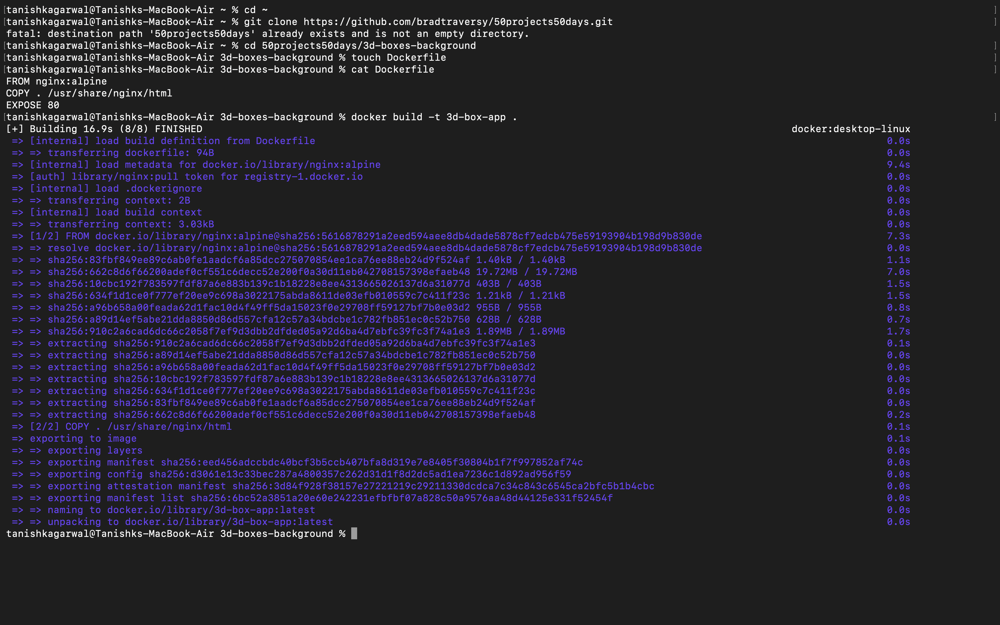
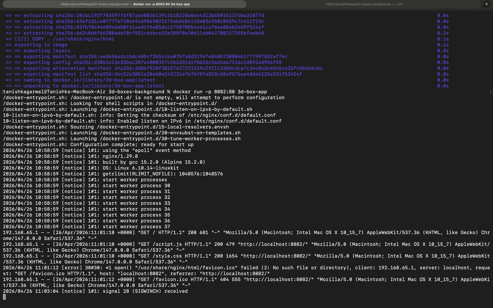
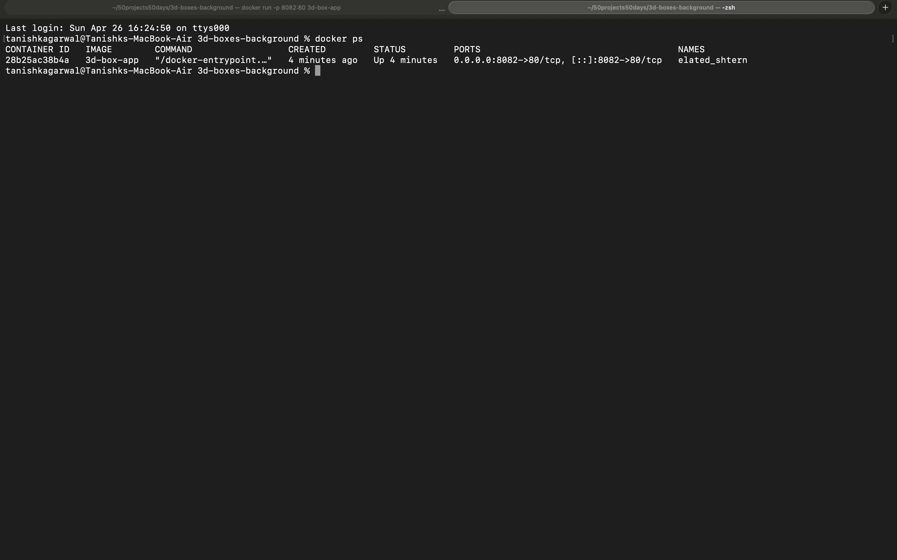
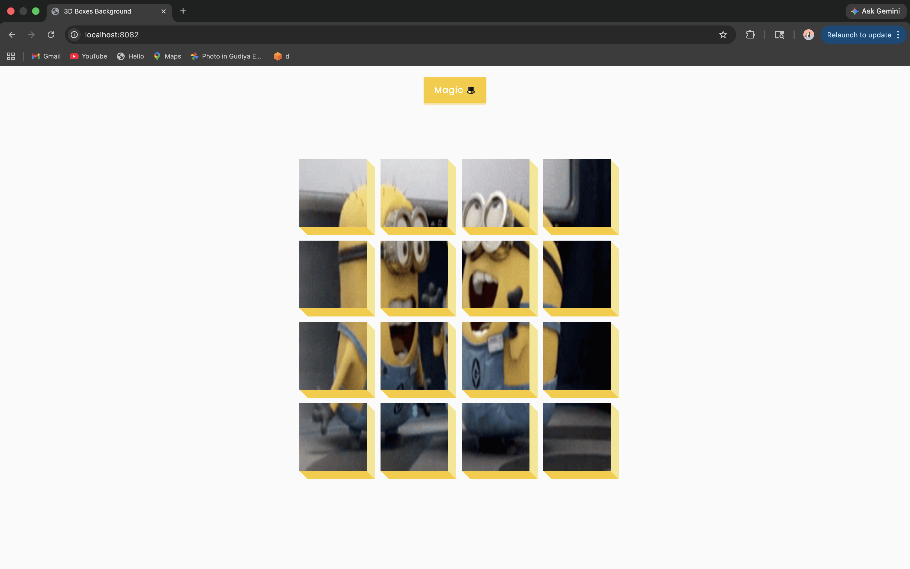

# Dockerized 3D Boxes Background

## Description
This project demonstrates containerization of a frontend application using Docker and Nginx.

## Build Docker Image
```bash
docker build -t 3d-box-app .

## Run Container
docker run -p 8082:80 3d-box-app

## Output
Application runs on:
http://localhost:8082

## docker ps
Used to verify container is running.

## Screenshots

### Docker Build


### Running Container


### docker ps Output


### Application Output


## Conclusion
Docker container successfully built and deployed.
